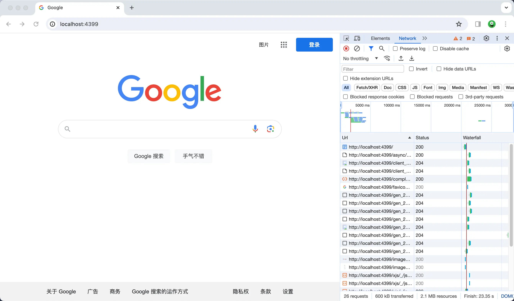

# cors-proxy-anywhere

Get rid of CORS errors in local development quick. Use Nginx and Docker to set up a simple reverse proxy.



## ⚡️ Get Started

[](https://hub.docker.com/r/idootop/cors-proxy-anywhere)

```shell
# Set up a proxy to connect your site on http://localhost:3000 with https://google.com
docker run -d \
    -p 3000:80 \
    -e PROXY_TO=https://google.com \
    idootop/cors-proxy-anywhere:2.0.0

# Make a second proxy for linking your site on http://localhost:4399 to http://localhost:3000
docker run -d \
    -p 4399:80 \
    -e PROXY_TO=http://host.docker.internal:3000 \
    idootop/cors-proxy-anywhere:2.0.0
```

## 👨‍💻 Problems

Local development can be a pain with CORS issues. Your backend might not allow CORS, like with [midjourney-proxy](https://github.com/novicezk/midjourney-proxy). Frontends like [chatgpt-web-midjourney-proxy](https://github.com/Dooy/chatgpt-web-midjourney-proxy) need to call these no-CORS backends, causing errors.

Sometimes you want to hit an external service from your frontend, even if it's not CORS-friendly (know the risks!).

Or, if your local site is on HTTP and the backend API is HTTPS, you can't mix them due to security reasons.

All of these are major headaches when developing locally.

## ✅ Solution

This project lets you whip up a reverse proxy with Docker and Nginx easier and faster for your dev needs. Just provide the destination host and your local port. Say goodbye to CORS errors and access external services as smoothly as local ones.

Please be aware that using this proxy alters the original request data, including IP, host, and other headers, and omits certain security headers from the proxy's responses. It also adds the necessary `Access-Control-Allow-Origin: '*'` headers to support CORS. Please proceed with caution and at your own risk.

## 🚨 DISCLAIMER

You assume complete responsibility for any use of this software and any damages that may result. The content of the provided repository is for educational purposes only and must not be used for commercial means or in violation of applicable laws and regulations. It is your duty to use this software with caution and to fully recognize the risks involved.
